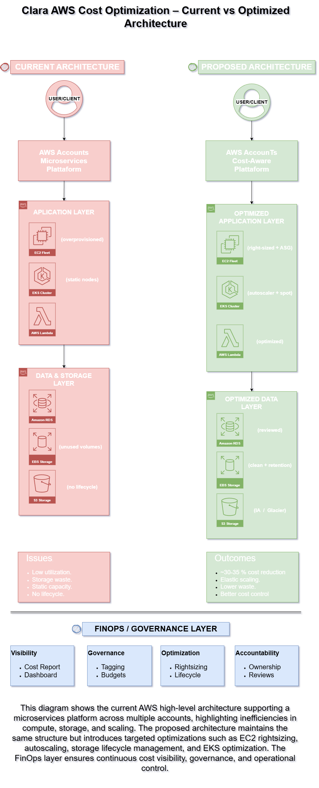
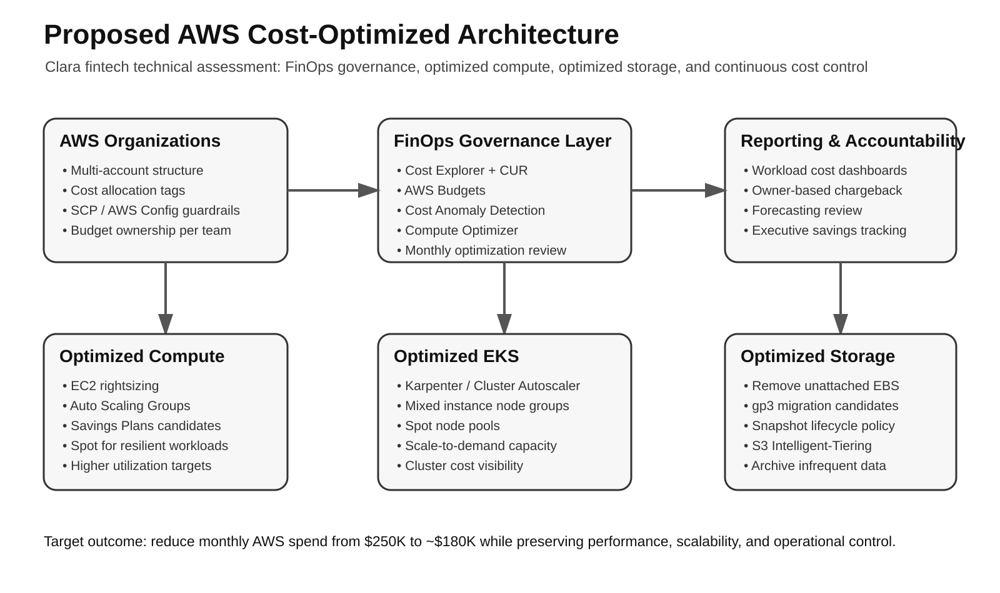

# Clara AWS Cost Optimization Assessment

## Executive Overview

This project presents an AWS cost optimization assessment for **Clara**, a fintech company operating a fast-growing multi-account AWS environment with a microservices architecture.

The current AWS monthly spend is **$250,000 USD**. The main cost drivers are EC2, EBS, RDS, S3, EKS, and Lambda. The objective of this assessment is to identify practical cost optimization opportunities without compromising performance, scalability, security, or production reliability.

The proposed optimization model estimates approximately **$70,000 USD in monthly savings**, reducing the monthly AWS spend from **$250,000 USD to $180,000 USD**, equivalent to a **28% reduction**.

---

## Technical Assessment Context

This submission addresses the AWS Cost Optimization Specialist technical assessment requirements:

- Analysis of current AWS resource usage and costs.
- Prioritized cost optimization recommendations with estimated impact in dollars and percentage.
- Implementation plan for applying the optimizations.
- Spreadsheet model with current costs, optimized costs, formulas, and assumptions.
- High-level AWS architecture diagrams showing the current and proposed optimized state.

---

## Deliverables

| Deliverable | File |
|---|---|
| Executive Report | `report/Clara_AWS_Cost_Optimization_Executive_Report.pdf` |
| Editable Executive Report | `report/Clara_AWS_Cost_Optimization_Executive_Report.docx` |
| Cost Optimization Spreadsheet | `spreadsheet/Clara_AWS_Cost_Optimization_Model.xlsx` |
| Current Architecture Diagram | `diagrams/current_architecture.png` |
| Current Architecture Draw.io Source | `diagrams/current_architecture.drawio` |
| Proposed Optimized Architecture Diagram | `diagrams/proposed_architecture.svg` |
| Proposed Architecture Draw.io Source | `diagrams/proposed_architecture.drawio` |
| Assumptions and Formula Logic | `docs/assumptions.md` |
| Implementation Plan | `docs/implementation_plan.md` |
| Detailed Strategy Appendix | `report/Clara_AWS_Cost_Optimization_Strategy_Appendix.pdf` |

---

## Current AWS Cost Baseline

Clara’s current monthly AWS spend is distributed as follows:

| Service | Monthly Cost | % of Total Spend | Key Observations |
|---|---:|---:|---|
| EC2 | $100,000 | 40% | 500 EC2 instances running; 60% are c5.xlarge; average CPU utilization is 30%. |
| EBS | $50,000 | 20% | 200 unattached EBS volumes and excessive snapshot retention. |
| RDS | $37,500 | 15% | Potential future opportunity for reserved capacity and storage optimization. |
| S3 | $25,000 | 10% | 50 TB stored; 80% currently in S3 Standard. |
| EKS | $25,000 | 10% | 3 EKS clusters with 10 c5.xlarge nodes each; static node capacity. |
| Lambda | $12,500 | 5% | Smaller optimization area; memory and duration tuning require additional observability review. |
| **Total** | **$250,000** | **100%** | Baseline monthly AWS spend. |

---

## Optimization Summary

The executive model focuses on validated, high-confidence optimization areas: EC2/EKS compute, EBS storage, and S3 lifecycle management.

| Optimization Area | Current Addressable Cost | Estimated Savings | Optimized Cost | Primary Actions |
|---|---:|---:|---:|---|
| EC2 | $100,000 | $35,000 | $65,000 | Rightsizing, autoscaling, Savings Plans after baseline validation. |
| EBS | $50,000 | $17,500 | $32,500 | Remove unattached volumes, migrate eligible volumes to gp3, apply snapshot lifecycle policies. |
| S3 | $25,000 | $10,000 | $15,000 | S3 Intelligent-Tiering, lifecycle policies, incomplete multipart upload cleanup. |
| EKS | $25,000 | $7,500 | $17,500 | Cluster Autoscaler or Karpenter, mixed instance types, Spot for fault-tolerant workloads. |
| RDS | $37,500 | $0 | $37,500 | Future opportunity after workload and capacity validation. |
| Lambda | $12,500 | $0 | $12,500 | Future opportunity after memory and execution profiling. |
| **Total** | **$250,000** | **$70,000** | **$180,000** | **Estimated 28% monthly cost reduction.** |

---

## Expected Financial Impact

| Metric | Amount |
|---|---:|
| Current Monthly AWS Spend | $250,000 |
| Estimated Monthly Savings | $70,000 |
| Optimized Monthly AWS Spend | $180,000 |
| Estimated Savings Rate | 28% |
| Estimated Annualized Savings | $840,000 |

---

## Architecture Diagrams

The following diagrams summarize the current AWS environment and the proposed optimized architecture.

### Current AWS Architecture

  

The current architecture represents Clara's multi-account AWS environment supporting microservices workloads across EC2, EKS, RDS, S3, EBS, and Lambda. The main optimization opportunities are related to underutilized compute capacity, unattached EBS volumes, excessive snapshot retention, static EKS node capacity, and limited storage lifecycle automation.

### Proposed Optimized AWS Architecture

  

The proposed architecture introduces a FinOps governance layer using AWS Cost Explorer, Cost and Usage Report, AWS Budgets, Cost Anomaly Detection, Compute Optimizer, lifecycle policies, EKS autoscaling, storage tiering, and phased optimization controls.

Source files are included in Draw.io format:

- `diagrams/current_architecture.drawio`
- `diagrams/proposed_architecture.drawio`

---

## Prioritized Recommendations

### 1. EC2 and EKS Compute Optimization

**Priority:** High  
**Estimated Monthly Savings:** $42,500  
**Primary Services:** EC2 and EKS

Clara’s compute environment shows signs of overprovisioning. EC2 represents 40% of total AWS spend, and average CPU utilization is approximately 30%. EKS clusters also run static node capacity using c5.xlarge nodes.

Recommended actions:

- Use AWS Compute Optimizer and CloudWatch metrics to identify underutilized EC2 instances.
- Rightsize EC2 instances based on CPU, memory, network, and workload behavior.
- Introduce Auto Scaling policies for elastic workloads.
- Apply Savings Plans only after rightsizing validates the stable compute baseline.
- Optimize EKS node groups using Cluster Autoscaler or Karpenter.
- Use mixed instance types and Spot capacity for non-critical, fault-tolerant workloads.

---

### 2. EBS Volume and Snapshot Optimization

**Priority:** High  
**Estimated Monthly Savings:** $17,500  
**Primary Services:** EBS and EBS Snapshots

EBS represents 20% of Clara’s AWS monthly spend. The environment includes 200 unattached EBS volumes and approximately 10 snapshots per in-use volume, indicating direct storage waste and insufficient lifecycle governance.

Recommended actions:

- Identify and delete unattached EBS volumes after owner validation.
- Migrate eligible volumes to gp3.
- Implement lifecycle policies for EBS snapshots.
- Define retention standards by workload criticality and compliance requirements.
- Enforce tagging standards for ownership, application, environment, and cost allocation.

---

### 3. S3 Storage Lifecycle Optimization

**Priority:** Medium  
**Estimated Monthly Savings:** $10,000  
**Primary Services:** S3

Clara currently stores 50 TB of data in S3, with 80% in the Standard storage class. This indicates potential savings through storage tiering and lifecycle policies.

Recommended actions:

- Use S3 Storage Lens to analyze storage access patterns.
- Move infrequently accessed objects to S3 Intelligent-Tiering.
- Apply lifecycle rules for Standard-IA, Glacier Instant Retrieval, Glacier Flexible Retrieval, or Deep Archive where applicable.
- Clean incomplete multipart uploads and expired objects.
- Define retention rules aligned with business and compliance requirements.

---

## Implementation Roadmap

### Phase 1: Visibility, Validation, and Governance

**Timeline:** Weeks 1–2

- Enable or validate AWS Cost Explorer, Cost and Usage Report, AWS Budgets, and Cost Anomaly Detection.
- Confirm tagging standards across accounts, workloads, applications, and environments.
- Establish cost baselines by account, service, application, and owner.
- Validate top cost drivers with engineering and application teams.
- Define approval workflows for resource deletion, rightsizing, and production changes.

### Phase 2: Waste Removal and Rightsizing

**Timeline:** Weeks 3–6

- Remove validated unattached EBS volumes.
- Apply EBS snapshot lifecycle policies.
- Review EC2 utilization and rightsize low-utilization instances.
- Optimize EKS worker nodes and introduce autoscaling.
- Apply S3 lifecycle policies to infrequently accessed data.
- Track actual savings weekly against the original baseline.

### Phase 3: Rate Optimization and Continuous FinOps

**Timeline:** Ongoing

- Apply Savings Plans or Reserved Instances after the compute baseline stabilizes.
- Review RDS reserved capacity opportunities.
- Create monthly cost review meetings with workload owners.
- Build dashboards for cost, utilization, savings, and forecast variance.
- Maintain budgets, anomaly detection, and cost governance controls.

---

## Assumptions

The model uses a conservative approach to avoid overstating savings.

| Area | Assumption |
|---|---|
| Baseline Spend | Total monthly AWS spend is $250,000. |
| EC2 Optimization | 35% reduction applied to EC2 based on low average CPU utilization and rightsizing opportunities. |
| EKS Optimization | 30% reduction applied to EKS through autoscaling, node optimization, and mixed capacity. |
| EBS Optimization | 35% reduction applied to EBS through unattached volume cleanup, gp3 migration, and snapshot lifecycle management. |
| S3 Optimization | 40% reduction applied to S3 through lifecycle policies and Intelligent-Tiering. |
| RDS Optimization | Treated as a future opportunity; no savings applied in the executive model. |
| Lambda Optimization | Treated as a future opportunity; no savings applied in the executive model. |
| Savings Plans | Recommended only after rightsizing and workload baseline validation. |
| Production Safety | All production changes require owner validation, rollback planning, and phased implementation. |

---

## Risk Controls

| Risk | Mitigation |
|---|---|
| Rightsizing impacts production performance | Start with non-production workloads, validate metrics, and roll out progressively. |
| Deleting storage still needed by teams | Require owner validation, backup confirmation, and deletion approval. |
| S3 lifecycle policies affect retrieval time or cost | Classify data by access pattern, business value, and compliance requirement before transition. |
| Savings Plans purchased too early | Rightsize first, then commit only to stable baseline usage. |
| Cost savings are not sustained | Implement budgets, anomaly detection, tagging governance, dashboards, and monthly FinOps reviews. |

---

## Tools and AWS Services Referenced

- AWS Cost Explorer
- AWS Cost and Usage Report
- AWS Budgets
- AWS Cost Anomaly Detection
- AWS Compute Optimizer
- Amazon CloudWatch
- Amazon EC2
- Amazon EBS
- Amazon S3
- Amazon EKS
- AWS Lambda
- Amazon RDS
- S3 Storage Lens
- AWS Organizations

---

## Final Recommendation

Clara can achieve an estimated **$70,000 USD in monthly savings** through a practical FinOps optimization plan focused on compute rightsizing, EBS cleanup, snapshot lifecycle management, S3 storage tiering, and EKS capacity optimization.

The recommended approach avoids risky one-time cuts. Instead, it establishes a repeatable cost governance model that balances financial efficiency with production reliability, scalability, and operational control.