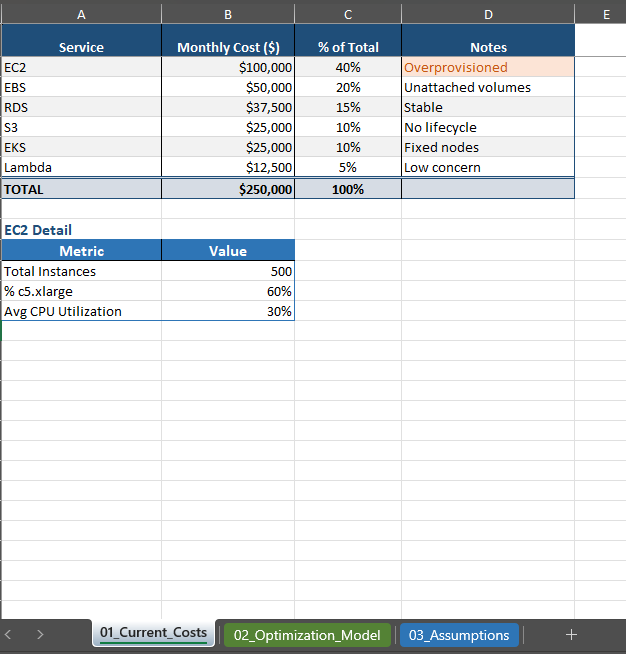
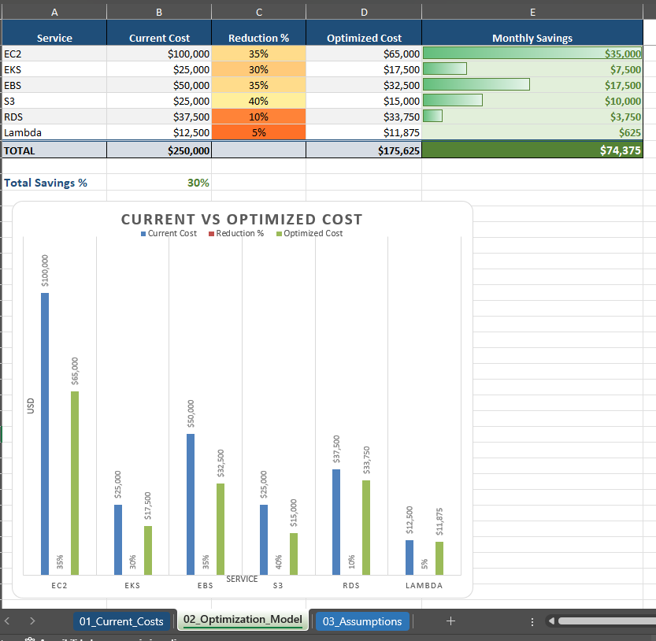
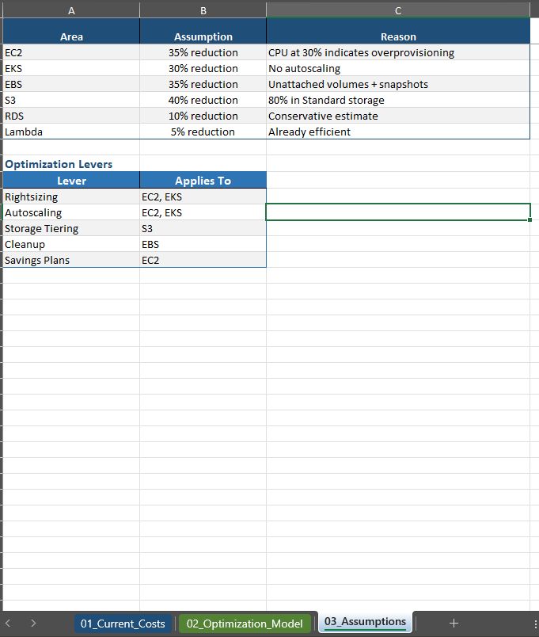

# AWS Cost Optimization Strategy  
## FinOps Consulting Case Study – Clara (Fintech)

---

## Executive Summary

Clara’s AWS environment reflects rapid growth, but also reveals structural inefficiencies in resource utilization and cost governance. Current cloud spend is heavily driven by overprovisioned compute and lack of lifecycle management in storage.

This proposal identifies an estimated **28–35% cost reduction opportunity (~$70K–$90K monthly)** without compromising performance or scalability.

The approach focuses on three strategic priorities:

1. Eliminating compute waste through rightsizing and autoscaling  
2. Optimizing storage lifecycle and unused resources  
3. Establishing FinOps governance for continuous cost control  

The objective is not only cost reduction, but aligning cloud spend with business growth, operational efficiency, and long-term scalability.

---

## Deliverables

This repository includes the following deliverables for the AWS Cost Optimization Specialist technical assessment:

| Deliverable | File |
|---|---|
| Executive Report | [Strategy Report](./report/Clara_AWS_Cost_Optimization_Strategy_Report.pdf) |
| Cost Optimization Spreadsheet | [Cost Optimization Model](./spreadsheet/Clara_AWS_Cost_Optimization_Model.xlsx) |
| Current AWS Architecture Diagram | [Current Architecture](./diagrams/current_architecture.png) |
| Proposed Optimized Architecture Diagram | [Proposed Architecture](./diagrams/proposed_architecture.svg) |
| Assumptions and Formula Logic | [Assumptions and Formula Logic](./docs/assumptions.md) |
| Implementation Plan | [Implementation Plan](./docs/implementation_plan.md) |

---

## Optimization Summary

| Area | Current Monthly Cost | Estimated Savings | Optimized Monthly Cost | Savings % |
|---|---:|---:|---:|---:|
| EC2 / Compute | $100,000 | $42,500 | $57,500 | 42.5% |
| EBS | $50,000 | $17,500 | $32,500 | 35.0% |
| S3 | $25,000 | $10,000 | $15,000 | 40.0% |
| RDS | $37,500 | TBD | $37,500 | 0.0% |
| EKS | $25,000 | Included in Compute | TBD | TBD |
| Lambda | $12,500 | TBD | $12,500 | 0.0% |
| **Total** | **$250,000** | **$70,000** | **$180,000** | **28.0%** |

---

## Business Context

- Monthly AWS Spend: **$250,000 USD**
- Architecture: **Microservices / Multi-account AWS environment**
- Core Services:
  - EC2
  - EBS
  - RDS
  - S3
  - EKS
  - Lambda

---

## Methodology

This analysis aligns with:

- **AWS Cloud Financial Management (CFM Framework)**
  - See → Save → Plan → Run
- **FinOps Lifecycle**
  - Inform → Optimize → Operate

The goal is to move from reactive cost control to **proactive financial engineering of cloud infrastructure**.

---

## Current Cost Distribution

<p align="center">
  
</p>

| Service | Allocation | Monthly Cost |
|--------|------------|--------------|
| EC2 | 40% | $100,000 |
| EBS | 20% | $50,000 |
| RDS | 15% | $37,500 |
| S3 | 10% | $25,000 |
| EKS | 10% | $25,000 |
| Lambda | 5% | $12,500 |
| **Total** | **100%** | **$250,000** |

---

## Key Insights

### Compute Inefficiency

Compute inefficiency is driven by static provisioning that does not reflect actual workload demand. With an average CPU utilization of approximately **30%**, the environment shows a structural misalignment between provisioned capacity and actual usage.

### Storage Waste

Unattached EBS volumes and excessive snapshots indicate lack of lifecycle governance and automated cleanup policies.

### S3 Cost Structure

A large portion of data remains in the S3 Standard storage class, suggesting missing lifecycle policies for tiered storage optimization.

### EKS Utilization

Cluster sizing appears static and not aligned with workload variability, indicating opportunities for autoscaling, workload scheduling, and node optimization.

---

## FinOps Maturity Gap

The current environment reflects a low-to-medium FinOps maturity level:

- Limited cost allocation visibility
- Reactive optimization practices
- Lack of clear cost ownership across teams
- Limited automation for cost controls
- No consistent lifecycle governance for storage and non-production resources

This proposal introduces:

- Cost accountability per workload
- Continuous monitoring and optimization
- Integration of cost into engineering decisions
- Governance through tagging, budgets, alerts, and automation

---

## Optimization Strategy

### 1. Compute Optimization

**Priority:** High  
**Area:** EC2 + EKS  
**Primary Driver:** Overprovisioning and static capacity

#### Actions

- Rightsize EC2 instances based on utilization data
- Enable autoscaling for variable workloads
- Introduce Spot Instances where workload resiliency allows it
- Review EKS node group sizing
- Implement cluster autoscaler or Karpenter for EKS optimization

#### Estimated Impact

- Estimated savings: **$42,500/month**
- Approximate impact: **~17% of total AWS spend**

---

### 2. EBS Optimization

**Priority:** High  
**Area:** EBS volumes and snapshots  
**Primary Driver:** Unused volumes and excessive snapshot retention

#### Actions

- Remove unattached EBS volumes after validation
- Reduce snapshot retention based on recovery requirements
- Move eligible workloads to gp3 where applicable
- Implement lifecycle policies for snapshot cleanup

#### Estimated Impact

- Estimated savings: **$17,500/month**
- Approximate impact: **~7% of total AWS spend**

---

### 3. S3 Lifecycle Optimization

**Priority:** Medium  
**Area:** S3 storage class management  
**Primary Driver:** Excessive use of S3 Standard for infrequently accessed data

#### Actions

- Classify data based on access patterns
- Transition eligible data to Standard-IA, Glacier Instant Retrieval, or Glacier Flexible Retrieval
- Implement lifecycle policies by bucket and data type
- Review retention requirements with product, compliance, and engineering teams

#### Estimated Impact

- Estimated savings: **$10,000/month**
- Approximate impact: **~4% of total AWS spend**

---

## Total Estimated Savings

| Category | Estimated Monthly Savings | Approx. Impact |
|----------|---------------------------|----------------|
| Compute Optimization | $42,500 | ~17% |
| EBS Optimization | $17,500 | ~7% |
| S3 Lifecycle Optimization | $10,000 | ~4% |
| **Total** | **~$70,000/month** | **~28%** |

Potential savings range after full implementation: **28–35%**.

---

## Optimized Cost Model

<p align="center">
  
</p>

---

## Assumptions

<p align="center">
  
</p>

Key modeling assumptions:

- Current monthly AWS spend is **$250,000 USD**
- Compute represents the largest optimization opportunity
- Average EC2 CPU utilization is approximately **30%**
- Non-critical workloads may be eligible for autoscaling or Spot usage
- Unattached EBS volumes can be removed after owner validation
- Snapshot retention can be reduced without violating recovery requirements
- A portion of S3 Standard data is eligible for lower-cost storage classes
- Savings estimates are conservative and should be validated through AWS Cost Explorer, CUR, Compute Optimizer, and workload-level metrics

---

## Architecture Overview

### Current State

<p align="center">
  
</p>

Current state characteristics:

- Overprovisioned EC2 compute resources
- Static EKS clusters
- Limited lifecycle governance for EBS and S3
- Limited cost allocation and accountability
- Reactive cost management

---

### Proposed State

<p align="center">
  
</p>
Proposed state characteristics:

- Rightsized EC2 with autoscaling
- Optimized EKS node groups
- S3 lifecycle management
- EBS cleanup and snapshot governance
- FinOps governance and monitoring layer
- Continuous cost visibility and accountability

---

## FinOps Operating Model

```text
Engineering → Workloads → AWS Resources → Cost Data → FinOps Layer → Business Decisions
```

Cost becomes a first-class metric alongside performance, reliability, and security.

The FinOps operating model connects technical usage patterns with financial accountability, enabling engineering, finance, and business stakeholders to make better decisions.

---

## Automation Layer

To ensure sustainability, the proposal includes an automation layer focused on continuous cost control.

Recommended controls:

- Scheduled shutdown of non-production environments
- Budget alerts and anomaly detection
- Tagging enforcement through Infrastructure as Code
- Automated detection of unattached EBS volumes
- Snapshot retention automation
- Continuous cost reporting by environment, product, and owner

---

## Governance Model

Recommended mandatory tags:

| Tag | Purpose |
|-----|---------|
| `environment` | Identifies prod, staging, dev, sandbox |
| `owner` | Defines technical or business owner |
| `product` | Maps resource to business product |
| `cost_center` | Enables financial allocation |
| `criticality` | Defines operational importance |
| `managed_by` | Identifies Terraform, manual, or platform ownership |

Governance should be enforced through:

- Terraform modules
- AWS Organizations
- Service Control Policies where applicable
- AWS Config rules
- CI/CD validation
- Periodic cost reviews

---

## Implementation Plan

### Phase 1: Quick Wins — Weeks 1–2

Objective: Reduce obvious waste with low operational risk.

Actions:

- Validate and remove unattached EBS volumes
- Review and reduce excessive snapshot retention
- Implement initial S3 lifecycle policies
- Identify idle and underutilized EC2 instances
- Enable baseline budget alerts

Expected outcome:

- Immediate cost reduction
- Better visibility into resource ownership
- Lower storage waste

---

### Phase 2: Compute Optimization — Weeks 3–6

Objective: Reduce compute waste while preserving performance and scalability.

Actions:

- Rightsize EC2 instances based on utilization metrics
- Apply autoscaling policies
- Optimize EKS node groups
- Evaluate Spot usage for resilient workloads
- Review Savings Plans or Reserved Instance opportunities

Expected outcome:

- Reduced compute spend
- Improved resource efficiency
- Better alignment between capacity and actual demand

---

### Phase 3: FinOps Governance — Ongoing

Objective: Establish long-term cost control and accountability.

Actions:

- Enforce tagging standards
- Establish cost ownership by product/team
- Implement recurring FinOps reviews
- Track cost per workload or product
- Integrate cost checks into CI/CD workflows
- Monitor anomalies and forecast spend

Expected outcome:

- Sustainable cloud cost governance
- Reduced risk of cost regression
- Improved financial accountability

---

## Risk of Inaction

Without intervention, cloud costs will continue scaling linearly with infrastructure growth. This creates several risks:

- Reduced operating margins
- Lower infrastructure efficiency
- Poor cost attribution across teams
- Increased forecasting variance
- Continued accumulation of unused resources
- Higher financial risk as platform usage grows

In a fintech environment, unmanaged cloud cost growth can directly affect unit economics, product margins, and scalability.

---

## Success Metrics

Recommended metrics to track after implementation:

| Metric | Target |
|--------|--------|
| Monthly AWS spend reduction | 28–35% |
| EC2 average utilization | Improve from ~30% to 50–60% |
| Unattached EBS volumes | 0 after validation |
| Snapshot retention compliance | 90%+ |
| S3 lifecycle coverage | 70%+ of eligible buckets |
| Tag compliance | 95%+ |
| Budget alert coverage | 100% of critical accounts |
| Cost ownership coverage | 100% of production workloads |

---

## Business Impact

This proposal enables Clara to:

- Reduce AWS spend by approximately **$70K–$90K per month**
- Improve infrastructure efficiency
- Strengthen cost accountability
- Support scalable growth without uncontrolled spend
- Improve forecasting and budget planning
- Align engineering decisions with business value

---

## Conclusion

This proposal demonstrates how applying FinOps principles and AWS-native capabilities can reduce cloud spend while preserving performance, scalability, and operational resilience.

The recommended approach moves Clara from reactive cost management to a structured Cloud Financial Management operating model based on visibility, optimization, governance, and accountability.

---

## Author

**Fernando Cuellar Rodriguez**  
Cloud Architect | FinOps-Oriented  
AWS • Azure • OCI • Terraform • DevOps
